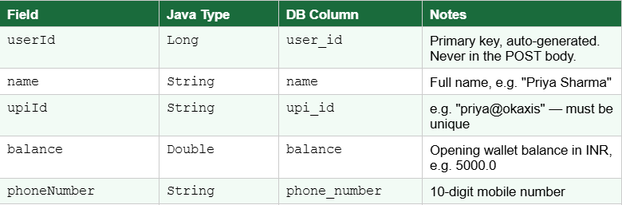
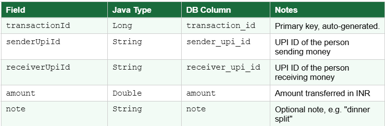
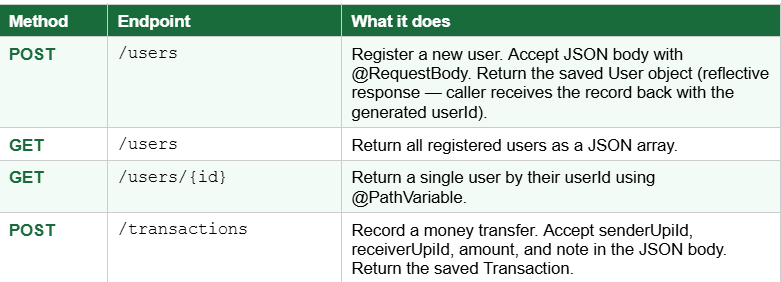

# PayFlow

> A UPI-style payment app — the REST API that powers it.

A **production-ready, OAuth2-secured Spring Boot microservice** implementing the PayFlow problem statement to enterprise standards: MySQL persistence with Flyway migrations, Hibernate ORM, fine-grained concurrency control, RabbitMQ event-driven messaging, distributed tracing, rate limiting, caching, RFC 7807 error handling, OpenAPI/Swagger contract, and 100% business-logic line coverage.

---

## Tech Stack

| Concern | Choice |
|---|---|
| Language / Runtime | Java 17 |
| Framework | Spring Boot 3.3.5 (Web, Data JPA, Security, AMQP, Cache, Actuator) |
| Persistence | MySQL 8 + Hibernate ORM, schema owned by **Flyway**, **HikariCP** pool |
| AuthN / AuthZ | OAuth2 Resource Server validating **Keycloak** JWTs (realm roles → `@PreAuthorize`) |
| Messaging | **RabbitMQ** (topic exchange + DLQ) for async transaction events |
| Caching | Caffeine (write-expiring, explicit eviction on balance change) |
| Rate limiting | Bucket4j token bucket per subject/IP |
| Observability | Micrometer + Actuator/Prometheus, structured JSON logs, W3C trace/span IDs |
| API docs | springdoc OpenAPI 3 / Swagger UI |
| Build / Test | Maven, JUnit 5 + Mockito (AAA), Testcontainers ITs, JaCoCo 100% gate |

## Quickstart

```bash
# 1. Start infrastructure (MySQL, RabbitMQ, Keycloak with the payflow realm pre-imported)
docker compose up -d mysql rabbitmq keycloak

# 2. Run the application
mvn spring-boot:run            # or: mvn clean package && java -jar target/payflow-api.jar

# 3. Get a token (password grant against the seeded Keycloak realm), then call the API
TOKEN=$(curl -s -d "client_id=payflow-public" -d "username=alice" -d "password=alice123" \
  -d "grant_type=password" \
  http://localhost:8081/realms/payflow/protocol/openid-connect/token | jq -r .access_token)

curl -X POST http://localhost:8080/api/v1/users -H "Authorization: Bearer $TOKEN" \
  -H "Content-Type: application/json" \
  -d '{"name":"Priya Sharma","upiId":"priya@okaxis","phoneNumber":"9876543210","openingBalance":5000.00}'
```

- **Swagger UI:** http://localhost:8080/swagger-ui.html · **OpenAPI:** `/v3/api-docs`
- **Seeded users:** `alice` / `alice123` (USER), `admin` / `admin123` (ADMIN)
- Run everything (app included) in containers: `docker compose up -d --build`

## Build & Test

```bash
mvn clean verify     # compile + unit tests (AAA) + Testcontainers ITs + JaCoCo 100% line-coverage gate
```

## The layered architecture

Requests flow through clearly separated layers (Separation of Concerns / SOLID):

| Layer | Package | Responsibility |
|---|---|---|
| **Controller** | `controller` | REST endpoints, validation, OpenAPI contract, authorization (`@PreAuthorize`). No business logic. |
| **Service** | `service` (+ `service.impl`) | Use-case orchestration, transactions, concurrency, caching. Interfaces decouple callers from impl (DIP). |
| **Repository** | `repository` | Spring Data JPA gateways — derived queries, JPQL `@Query`, pagination. |
| **Entity** | `entity` / `enums` | Hibernate-mapped domain model with auditing + optimistic `@Version`. |
| **DTO / Mapper** | `dto`, `mapper` | Immutable request/response records + MapStruct mapping; entities never leak over the wire. |
| **Cross-cutting** | `config`, `filter`, `exception`, `messaging`, `concurrency`, `util` | Security, tracing, rate limiting, error handling, events, locking, ID generation. |

## How Spring Boot's three pillars show up here

1. **Embedded server** — `PayflowApplication.main()` boots an embedded Tomcat; no external servlet container or WAR. The whole service ships as one runnable `payflow-api.jar` (see `Dockerfile`).
2. **Auto-configuration** — declaring the starters wires Hibernate/HikariCP from `spring.datasource.*`, the OAuth2 resource server from a single `issuer-uri`, RabbitMQ from `spring.rabbitmq.*`, and the Caffeine cache manager — all without boilerplate `@Bean` plumbing.
3. **Production-ready defaults** — Spring Boot Actuator exposes `/actuator/health` (liveness/readiness probes), `/metrics`, and `/prometheus` out of the box; combined with Flyway, structured logging, and graceful shutdown this is deploy-ready.

## Engineering highlights (addressing prior mentor feedback)

- **Fine-grained concurrency** — `StripedLockRegistry` serialises transfers per-account (256 lock stripes, deadlock-free ascending acquisition) layered over Hibernate optimistic `@Version`, instead of one coarse lock.
- **Strong API contract** — versioned `/api/v1`, exhaustive bean-validation, OpenAPI 3 schemas, RFC 7807 `ProblemDetail` errors with a stable `errorCode` catalogue.
- **Observability** — W3C-compliant `traceId` (32 hex) + `spanId` (16 hex) on every request and log line, structured JSON logging, Micrometer metrics, async audit trail.
- **Production persistence** — MySQL + Flyway migrations + tuned HikariCP pool (no in-memory H2).
- **Security hardening** — OAuth2/JWT, per-client rate limiting, input sanitisation, CORS + security headers (HSTS, CSP, frame-deny).
- **Performance** — Caffeine caching with correctness-preserving eviction, indexed lookups, batch-friendly Hibernate settings.

## Documentation

| Document | Contents |
|---|---|
| [Architecture](docs/architecture.md) | System overview, design goals, component diagram |
| [HLD](docs/hld.md) | High-level design, request flow, infra topology, scaling |
| [LLD](docs/lld.md) | Class responsibilities, transfer algorithm, exception mapping |
| [UML](docs/uml.md) | Class, sequence (send-money / register), and ER diagrams |
| [Database Schema](docs/database-schema.md) | Tables, columns, indexes, JPQL examples |
| [Project Structure](docs/project-structure.md) | Annotated directory tree |
| [API Reference](docs/api.md) | Endpoints, roles, schemas, curl examples |

---

## Assignment Brief

> The original problem statement this project implements.

### 1. The Scenario

Every time you tap **Pay** on PhonePe or Google Pay, a backend server receives that request, validates the sender, records the transaction, and updates balances — all in under a second.

PayFlow is a simplified version of that system. You are building the REST API that powers it: registering users, giving them a wallet balance, and recording money transfers between them.

There is no UI. No frontend. Just a clean, database-backed API that a frontend team could plug into tomorrow — which is exactly how real fintech backends are built and handed off.

By the end of this assignment, the following will work entirely through HTTP calls from your terminal:

- **Register a user** — `POST` a new user with a name, UPI ID, and opening balance.
- **Look up a user** — `GET` a user by their ID, or search by their UPI ID.
- **List all users** — `GET` every registered user in the system.
- **Send money** — `POST` a transaction from one user to another. The amount and sender/receiver get persisted.

### 2. Your Entities

PayFlow has one core entity for this assignment: the **User**. Keep it simple — relationships (like linking transactions to users via foreign keys) are a topic for the next session.

#### The User Entity



> Notice that camelCase Java field names (`upiId`, `phoneNumber`) automatically become snake_case column names (`upi_id`, `phone_number`) in the database — this is the JPA naming convention demonstrated in class.

#### The Transaction Entity



A `Transaction` records a single money transfer. It is a second entity — build it as a plain `@Entity` with the fields below. You do not need to model the relationship between `Transaction` and `User` with foreign keys yet (that comes in a future session). Simply store the sender and receiver UPI IDs as plain strings for now.

## 3. Tasks

### Task 1 — Project Setup (10 marks)

- Create a Spring Boot project via [Spring Initializr](https://start.spring.io/) with: **Spring Web**, **Spring Data JPA**, **H2 Database**.
- Organise into four packages: `entity`, `repository`, `service`, `controller`.
- Write a `README.md` covering: how to run the app, what each layer does, and how Spring Boot's three features (embedded server, auto-configuration, production-ready defaults) appear in this PayFlow project specifically.

### Task 2 — Entities & Database (15 marks)

- Create both the `User` and `Transaction` entity classes with the fields above.
- Annotate each with `@Entity`, `@Id`, `@GeneratedValue`. No hand-written SQL — Spring Data JPA creates both tables automatically.
- Add `spring.jpa.show-sql=true` to `application.properties`. On first startup, paste the two `create table (...)` statements from the console into your write-up.
- Open `/h2-console` and screenshot both tables (`SELECT * FROM USER` and `SELECT * FROM TRANSACTION`) showing correct columns before any data is inserted.

### Task 3 — Repository Layer (10 marks)

- Create `UserRepository` extending `JpaRepository<User, Long>` and `TransactionRepository` extending `JpaRepository<Transaction, Long>`.
- In `UserRepository`, add the derived query method `findByUpiId(String upiId)`. This is how your app will look up a user before sending money.
- In your README, paste the SQL JPA generates for `findByUpiId` and explain:
  - (a) how JPA derives it from the method name, and
  - (b) what the `?` placeholder means.

### Task 4 — Service Layer (15 marks)

- Create `UserService` (`@Service`) with methods: `registerUser(User user)`, `getAllUsers()`, `getUserById(Long id)`, `findByUpiId(String upiId)`.
- Create `TransactionService` (`@Service`) with method: `sendMoney(Transaction transaction)`. For now this just saves the transaction record — balance deduction logic is not required.
- In both services, inject the respective repository using `@Autowired`. Add a comment in the code explaining what Spring is doing at startup to make this work.

### Task 5 — Controller & REST Endpoints (30 marks)

- Create `UserController` (`@RestController`, base path `/users`) and `TransactionController` (`@RestController`, base path `/transactions`).
- Implement the following endpoints:



- Test all four endpoints using `curl` from your terminal. Include the curl commands and output for each. After registering two users and sending money between them, screenshot `SELECT * FROM USER` and `SELECT * FROM TRANSACTION` in the H2 console.
- Demonstrate `@RequestBody`: call `POST /users` once with `@RequestBody` and once without. Show the difference in what the `User` object looks like inside the controller (debugger or `println`). Explain in one paragraph why the fields are `null` without it.

### Task 6 — Custom Query (10 marks)

- Wire `findByUpiId` into the service and controller, and add a `GET /users/upi/{upiId}` endpoint that returns the user matching that UPI ID.
- Add a second method to `UserRepository` using the `@Query` annotation with a JPQL query (not native SQL) — for example, find all users whose balance is above a given amount.
- In your README, compare the three approaches to custom queries (derived method names, `@Query` JPQL, and native SQL) and explain why native queries are the least preferred.

## 4. Conceptual Write-Up (10 marks)

Answer all six questions in your own words, 3–5 sentences each. Every question maps to something covered in class.

1. **Request lifecycle** — Trace what happens from the moment `curl` sends `POST /users` to the moment your `createUser` method runs. Name the Dispatcher Servlet and Handler Adapter in your answer.
2. **Serialisation** — When you POST a JSON payload like `{"name":"Priya","upiId":"priya@okaxis"}`, what converts it into a Java `User` object? What happens if the JSON key is `"upi_id"` instead of `"upiId"`?
3. **Spring Boot features** — Name the three Spring Boot features. For each one, point to a specific thing in your PayFlow project where that feature is doing work for you.
4. **Spring vs. Spring Boot** — If you had used plain Spring instead of Spring Boot for PayFlow, what would you have had to set up manually? What does Spring Boot take care of automatically?
5. **Stateless REST** — Your `POST /transactions` endpoint does not remember anything about the previous request. What does stateless mean, and why does it matter if PayFlow eventually runs on three servers behind a load balancer?
6. **Persistence** — You stored transactions in the H2 database, not in a Java `List`. What would have happened to all the transaction records if you had used a `List` and then restarted the server? Why is this unacceptable for a payments app?

## Submission Guidelines

- Push the complete Spring Boot project to a **public GitHub repo**, named `payflow-api` or similar.
- Place your write-up (answers + screenshots) as a PDF or Word doc in the repo root.
- Make sure the app starts cleanly from a fresh run before submitting.

## Deliverables

- GitHub link
