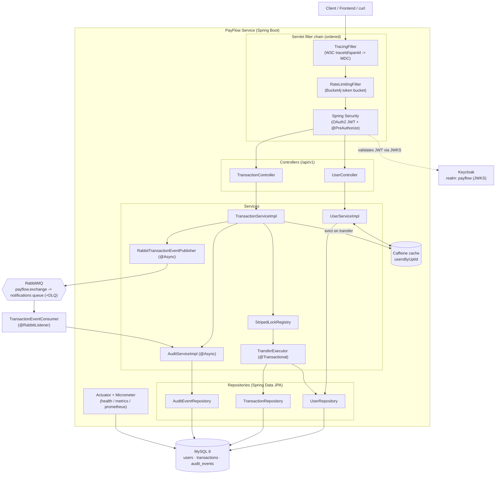

# PayFlow — Architecture

> System overview, design goals, and how each engineering decision maps to the
> implementation that lives under `src/main/java/com/payflow/**`.

## 1. What PayFlow is

PayFlow is a **single, modular Spring Boot microservice** that exposes the REST API
behind a UPI-style payment app: it registers wallet-owning users, looks them up by
public reference or UPI ID, and records money transfers that atomically debit the
sender and credit the receiver.

The service is built on **Java 17** and **Spring Boot 3.3.5**, packaged as an
executable jar (`payflow-api.jar`) and a hardened, non-root Docker image. It is
stateless at the HTTP layer — every request carries its own Keycloak-issued JWT — so
it can be scaled horizontally behind a load balancer without sticky sessions.

## 2. Design goals

| Goal | How it shows up in the code |
| --- | --- |
| **Correct money handling** | All monetary values are `BigDecimal(19,2)`; columns are `DECIMAL(19,2)`. No `double` anywhere. |
| **Safe concurrency** | Per-account striped locking (`StripedLockRegistry`) plus DB optimistic locking (`@Version` on `BaseEntity`). |
| **Strong, stable API contract** | DTO records with Bean Validation, RFC 7807 problem responses, a machine-readable `ErrorCode` catalogue, and versioned `/api/v1` paths. |
| **Separation of concerns** | Clean layering: `controller -> service (interface) -> service.impl -> repository`; mapping isolated in MapStruct mappers; cross-cutting concerns in `filter`/`config`. |
| **Observability** | W3C tracing in `TracingFilter`, structured JSON logging, Actuator + Micrometer/Prometheus. |
| **Resilience** | Async event publication that never breaks the write path, RabbitMQ DLQ, retryable optimistic-lock conflicts, graceful global exception handling. |
| **Security by default** | OAuth2 resource server, method-level `@PreAuthorize`, CORS allow-list, HSTS/CSP/frame-deny headers, input sanitisation, rate limiting. |

## 3. Why a modular single service (and not many services)

The assignment domain is one bounded context: *users and the transfers between
them*. Splitting it into several network-hopping services would add distributed
transactions, eventual-consistency headaches, and operational overhead with no
domain benefit. PayFlow instead keeps **one deployable unit** but enforces **module
boundaries by package**, each with a single responsibility:

```
entity · enums · repository · dto · mapper · exception
config · util · concurrency · messaging · event · filter
service · service.impl · controller
```

Inter-layer dependencies always point inward toward abstractions (controllers depend
on `*Service` interfaces, services depend on the `TransactionEventPublisher`
interface, not on RabbitMQ). This preserves the option to extract a true
microservice later (e.g. a dedicated notification service already has its seam: the
RabbitMQ consumer) without paying that cost today.

## 4. Technology choices and rationale

| Concern | Choice | Why |
| --- | --- | --- |
| Language / framework | Java 17, Spring Boot 3.3.5 | LTS Java; Boot gives embedded Tomcat, auto-config, and production-ready Actuator out of the box. |
| Persistence | MySQL 8 + Hibernate (JPA) | Durable RDBMS with ACID transactions for money movement (replaces the in-memory H2 of the original brief). |
| Schema management | Flyway (`V1__init_schema.sql`) | Schema is versioned and owned by migrations; Hibernate runs `ddl-auto: validate` and never mutates the schema. |
| Connection pool | HikariCP | Fast, well-tuned pool; sized for high-traffic via `maximum-pool-size`. |
| Auth | Keycloak (OIDC) + Spring OAuth2 Resource Server | Standard JWT validation against the realm JWKS; no password handling in PayFlow itself. |
| Async messaging | RabbitMQ (topic exchange + DLQ) | Decouples notification/audit side-effects from the request path. |
| Caching | Caffeine | In-process, bounded, expiring cache for the hot user-by-UPI lookup. |
| Rate limiting | Bucket4j (token bucket) | Per-subject/IP throttling with `Retry-After`. |
| Mapping | MapStruct | Compile-time entity→DTO mapping, no reflection. |
| Boilerplate | Lombok | Getters/builders on entities. |
| API docs | springdoc-openapi (Swagger UI) | Live, contract-first documentation with a JWT "Authorize" button. |
| Observability | Actuator + Micrometer Prometheus + Logstash encoder | Health/metrics/Prometheus scrape; structured JSON logs in docker/prod. |
| Tests | JUnit 5, Spring Security Test, Testcontainers (MySQL, RabbitMQ) | Real infra in tests; JaCoCo enforces a line-coverage gate. |

## 5. How the mentor-feedback gaps (a–f) are addressed

**(a) Concurrency control.** `StripedLockRegistry` holds a fixed array of 256
`ReentrantLock` stripes keyed by UPI ID. A transfer locks *both* parties via
`executeWithLocks(sender, receiver, …)`, always acquiring the lower stripe index
first to impose a global ordering and prevent deadlock. The actual debit/credit +
ledger write lives in `TransferExecutor.execute(...)`, a separate `@Transactional`
bean invoked **inside** the locks — so the DB commit happens *before* the locks
release. `@Version` on every entity adds a database-level optimistic-lock safety net;
a lost-update conflict surfaces as `ObjectOptimisticLockingFailureException` and is
translated to a retryable HTTP 409.

**(b) Strong API contract.** Versioned `/api/v1` paths; immutable DTO records with
comprehensive Bean Validation (`@NotBlank`, `@Pattern`, `@DecimalMin`, `@Digits`);
RFC 7807 `ProblemDetail` error bodies carrying a stable `errorCode` and the
`traceId`; an explicit `PagedResponse` envelope so Spring's internal `PageImpl` JSON
never leaks.

**(c) Audit trails + observability.** The append-only `AuditEvent` entity records who
did what, against which entity, under which trace. Writes happen asynchronously
(`AuditServiceImpl`, `@Async` + `REQUIRES_NEW`) so they never block or roll back the
business transaction. `TracingFilter` and structured JSON logging close the loop.

**(d) Real database.** MySQL 8 with Flyway migrations and HikariCP replaces the
original in-memory H2.

**(e) Security hardening + rate limiting + input sanitisation.** `SecurityConfig`
sets HSTS, CSP, `X-Content-Type-Options`, frame-deny, and referrer policy; CORS is an
explicit allow-list. `RateLimitingFilter` (Bucket4j) throttles per subject/IP and
returns 429 + `Retry-After`. `InputSanitizer` normalises and strips control
characters / angle brackets from persisted free-text.

**(f) Query optimisation + caching.** Unique and secondary indexes back every lookup
(`upi_id`, `reference_id`, sender/receiver/created_at). The Caffeine cache
`usersByUpiId` (max 10k, expire-after-write 5m) fronts the hot UPI lookup and is
**explicitly evicted** for both parties on every transfer so a balance is never
served stale.

## 6. Component diagram



## 7. Runtime topology

Four containers defined in `docker-compose.yml`: `mysql` (8.4), `rabbitmq`
(3.13-management), `keycloak` (25.0, imports `payflow-realm.json`), and `payflow`
(the app, profile `docker`). The app waits on MySQL/RabbitMQ health before starting.
See [`hld.md`](./hld.md) for the topology diagram and scaling notes.
