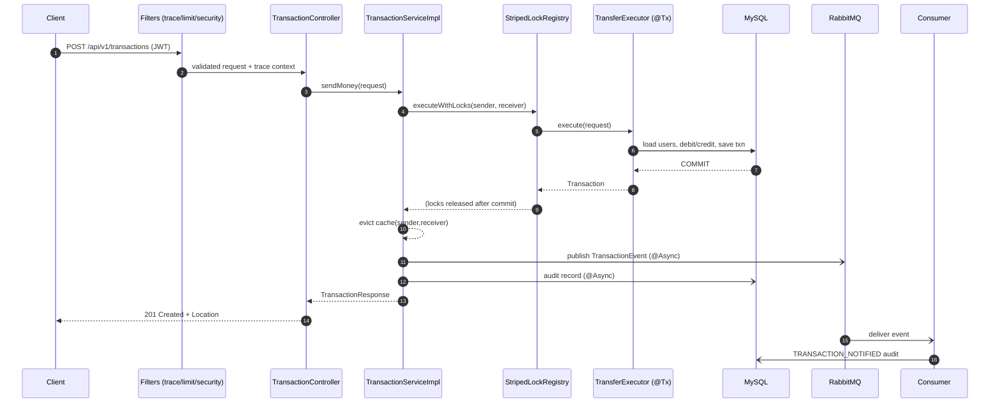
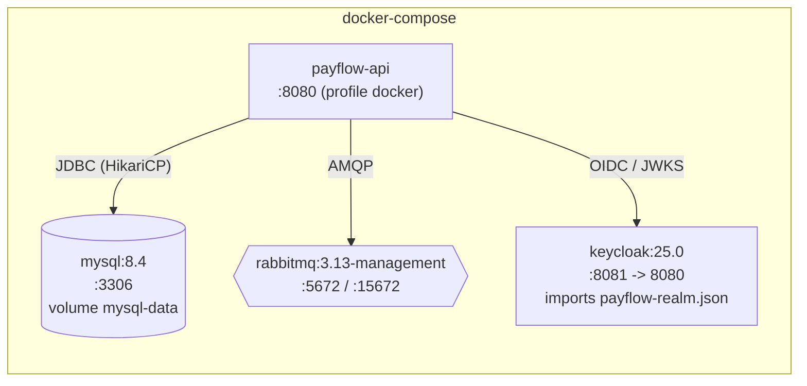

# PayFlow — High-Level Design (HLD)

> Major components and their responsibilities, the end-to-end request flow, the
> infrastructure topology, and notes on scaling, availability, and data lifecycle.

## 1. Major components

| Component | Package | Responsibility |
| --- | --- | --- |
| **Controllers** | `controller` | HTTP boundary for `/api/v1`. Bind & validate requests, enforce `@PreAuthorize`, return DTOs / `201 Created` with `Location`. |
| **Services (API)** | `service` | Use-case interfaces (`UserService`, `TransactionService`, `AuditService`) — the stable contract controllers depend on. |
| **Service implementations** | `service.impl` | Business rules: registration, transfer orchestration, audit. `TransferExecutor` performs the atomic ledger write. |
| **Concurrency** | `concurrency` | `StripedLockRegistry` — per-account locking that serialises contending transfers. |
| **Repositories** | `repository` | Spring Data JPA gateways for `User`, `Transaction`, `AuditEvent`. |
| **Entities** | `entity` | JPA aggregates over a shared `BaseEntity` (id, timestamps, `@Version`). |
| **DTO + Mapper** | `dto`, `mapper` | Request/response records; MapStruct entity→DTO mapping. |
| **Messaging** | `messaging`, `event`, `config.RabbitConfig` | Publish/consume `TransactionEvent` over RabbitMQ. |
| **Filters** | `filter` | `TracingFilter` (distributed trace context) and `RateLimitingFilter` (Bucket4j). |
| **Security** | `config.SecurityConfig`, `config.KeycloakRealmRoleConverter` | OAuth2 resource-server, role mapping, HTTP hardening, CORS. |
| **Cross-cutting config** | `config` | Caching, async executor, JPA auditing, OpenAPI, typed properties. |
| **Exception handling** | `exception` | `ErrorCode` catalogue + `GlobalExceptionHandler` → RFC 7807. |
| **Utilities** | `util` | `IdentifierGenerator` (ULID references), `TraceIdentifierFactory`, `InputSanitizer`. |

## 2. Request-flow narrative — `POST /api/v1/transactions` (send money)

1. **Filter chain.** `TracingFilter` (highest precedence) resolves or mints a 32-hex
   `traceId` and a fresh 16-hex `spanId`, puts them in the SLF4J MDC, and echoes them
   as `X-Trace-Id` / `X-Span-Id` response headers. `RateLimitingFilter` consumes a
   token from the caller's bucket (429 + `Retry-After` if empty). Spring Security
   validates the Keycloak JWT and maps realm roles to `ROLE_*` authorities.
2. **Controller.** `TransactionController.sendMoney` runs after `@PreAuthorize`
   (`USER` or `ADMIN`) and Bean Validation of the `SendMoneyRequest` body.
3. **Service orchestration.** `TransactionServiceImpl.sendMoney`:
   - rejects sender == receiver (`InvalidTransferException` → 400);
   - calls `lockRegistry.executeWithLocks(sender, receiver, …)` to serialise per
     account in deadlock-free order;
   - inside the locks invokes the `@Transactional` `TransferExecutor.execute(...)`,
     which loads both users, checks balance, debits/credits, and saves a `COMPLETED`
     `Transaction`. The transaction **commits before** the locks release.
4. **Post-commit side-effects.** The cache entries for both UPI IDs are evicted; a
   `TransactionEvent` is published `@Async` to RabbitMQ; an audit record is written
   `@Async`. None of these can break or delay the now-durable transfer.
5. **Async consumer.** `TransactionEventConsumer` reads the notifications queue,
   re-binds the `traceId` to its MDC, and records a `TRANSACTION_NOTIFIED` audit
   entry.
6. **Response.** `201 Created` with the `TransactionResponse` body and a `Location`
   header pointing at the new transaction.

## 3. Infrastructure topology (docker-compose)

| Service | Image | Port(s) | Notes |
| --- | --- | --- | --- |
| `payflow` | built from `Dockerfile` | 8080 | Non-root user, `MaxRAMPercentage=75`. `depends_on` MySQL/RabbitMQ health. |
| `mysql` | `mysql:8.4` | 3306 | Persistent `mysql-data` volume; healthcheck via `mysqladmin ping`. |
| `rabbitmq` | `rabbitmq:3.13-management` | 5672 / 15672 | Management UI; healthcheck via `rabbitmq-diagnostics ping`. |
| `keycloak` | `quay.io/keycloak/keycloak:25.0` | 8081→8080 | `start-dev --import-realm`; realm `payflow` with users `alice`/`admin`. |

## 4. Scaling & availability

- **Stateless app tier.** No HTTP session; all state is in MySQL/RabbitMQ/Keycloak.
  Run *N* replicas behind a load balancer and scale horizontally.
- **Rate-limit store.** `RateLimitingFilter` currently keeps buckets in an in-process
  `ConcurrentHashMap` — correct for a single instance. For multi-instance fairness,
  swap to a **distributed Bucket4j backend (e.g. Redis/Hazelcast)** so the quota is
  enforced cluster-wide. (Documented seam; the filter is the only change point.)
- **Database read scaling.** Reads (user/transaction lookups, paged history) can be
  routed to **MySQL read replicas** while writes go to the primary; the read-only
  service methods (`@Transactional(readOnly = true)`) already mark the candidates.
- **Connection pool.** HikariCP is sized via `PAYFLOW_DB_POOL_MAX/MIN`; tune per
  replica so total connections stay within the DB's limit.
- **Cache.** Caffeine is per-instance; for a shared, larger cache move the
  `usersByUpiId` cache to a distributed store (e.g. Redis) — the Spring Cache
  abstraction keeps the annotations unchanged.
- **Messaging durability.** The exchange and queue are durable and the notifications
  queue has a **dead-letter queue**; listener retry is configured (3 attempts,
  exponential backoff) so transient consumer failures don't lose events.
- **Observability for ops.** `/actuator/health` (with liveness/readiness probes),
  `/actuator/prometheus` for scraping, and JSON logs keyed by `traceId` for
  correlation across replicas and the async consumer.

## 5. Data archival / lifecycle note

`transactions` and `audit_events` are **append-heavy, immutable** tables that grow
without bound. A production deployment would add a lifecycle policy:

- **Partition / archive by time.** Range-partition (or periodically export) on
  `created_at`; both tables are already indexed on `created_at` / trace.
- **Hot vs. cold storage.** Keep a rolling window (e.g. 12–24 months) of
  transactions in MySQL for online history queries; move older rows to cheap cold
  storage (object store / data warehouse) for compliance retention.
- **Audit retention.** `audit_events` is append-only by design; retain per regulatory
  requirements, then archive — never hard-delete within the retention window.

No archival job is implemented in this assignment scope; the schema and indexes are
laid out so it can be added without a breaking change.
