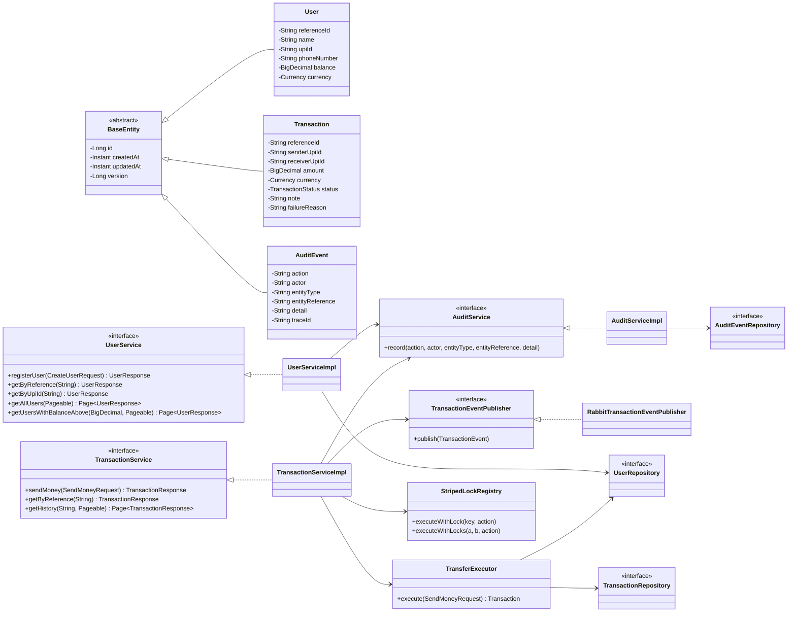
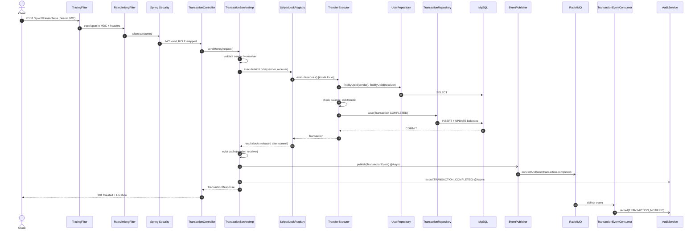
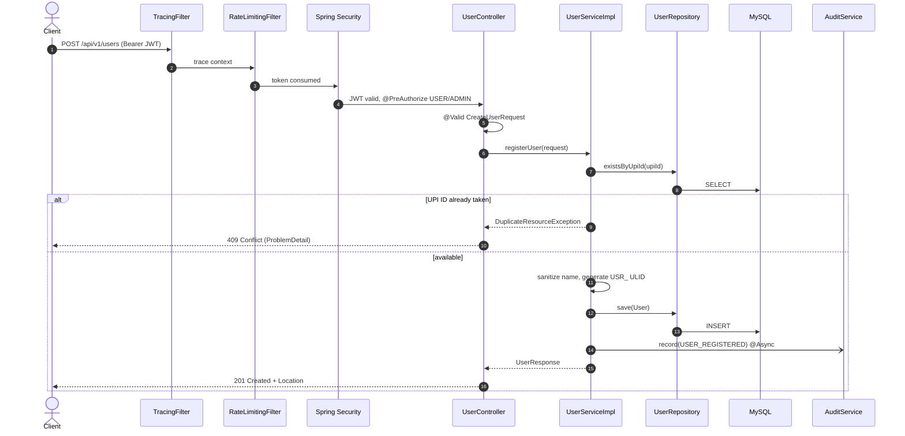
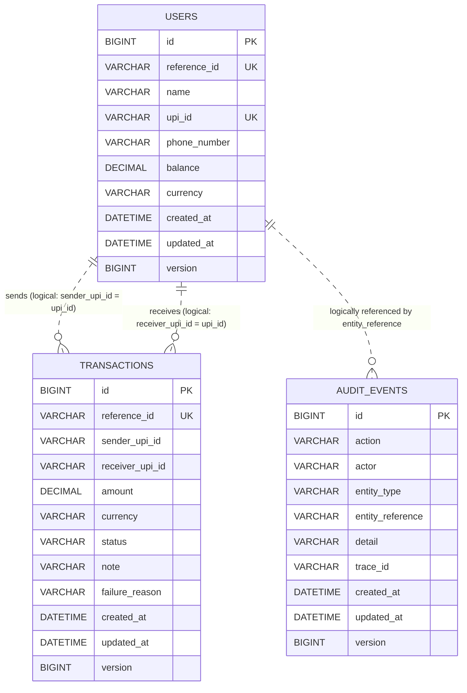

# PayFlow — UML & Diagrams

> Class diagram, send-money and register-user sequence diagrams, and the ER diagram.
> All diagrams are Mermaid and render on GitHub.

## 1. Class diagram (entities + key services/interfaces)

## 2. Sequence diagram — Send money

## 3. Sequence diagram — Register user

## 4. ER diagram

> The application stores sender/receiver as plain UPI-ID strings (no FK constraints,
> per the assignment scope). The dashed relationships below are **logical**
> references via `upi_id`, not enforced foreign keys.

